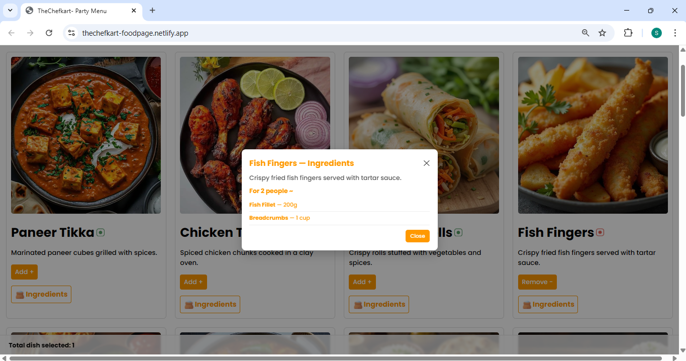

# 🍽️ Food Ordering Web App

A simple, responsive **Food Ordering UI** built with **React.js**.  
This project demonstrates skills in **state management, reusable components, filtering logic, and UI design** — similar to real-world food delivery apps (Swiggy, Zomato, etc.).

---

## ✨ Features

- 📌 **Category Tabs** — Filter dishes by category (`STARTER`, `MAIN COURSE`, `SIDES`, `DESSERT`, etc.).
- 🔎 **Search Functionality** — Search dishes by name or description.
- 🥗 **Veg / Non-Veg Filters** — Toggle between Veg and Non-Veg dishes.
- ➕ **Add / Remove Dishes** — Select your favorite dishes with dynamic count.
- 📖 **Ingredients Modal** — View dish ingredients in a modal (without navigation).
- 📱 **Responsive Layout** — Grid-based design for large screens, stacked view for mobile.
- 🎨 **Custom Styling** — Styled with simple CSS (no Bootstrap).

---

## 🛠️ Tech Stack

- **Frontend**: React.js (Functional Components + Hooks)
- **Styling**: CSS3 (Flexbox, Grid, Media Queries)
- **Deployment**: Netlify

---

## 🚀 Getting Started

### 1️⃣ Clone the repo
```bash
git clone https://github.com/shalini2376/food-ordering-app.git
cd food-ordering-app

2️⃣ Install dependencies

npm install

3️⃣ Run locally

npm start

### 📸 Screenshots
)


## 📂 Folder Structure

src/
├── components/
│   ├── Header.js
│   ├── Filters.js
│   ├── DishList.js
│   ├── DishCard.js
│   └── IngredientModal.js
├── data/
│   └── mockDishes.js
├── App.js
└── App.css

### 🌐 Live Demo

Hosted link: https://thechefkart-foodpage.netlify.app
